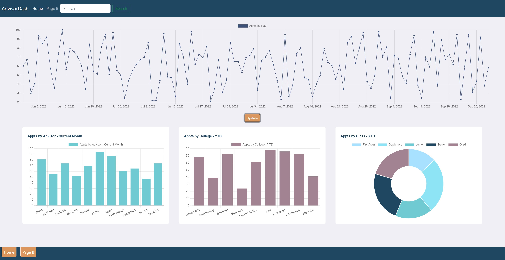

# Advising Service - Sample Dashboard

This demo projects represents a basic set of data visualizations for an advising service. I undertook this project to further develop my front-end skills with React and Charts.js with a specific focus on visualizing data.

## Goals and Features

The aim of the project was to simulate a multipage dashboard with data visualizations using React and Charts.js.

The dashboard displays 3 types of graphs: time-data line chart, category data bar chart, and category data doughnut chart. The data displayed are generated by the app and are completely random. Clicking update or clicking on the page tab buttons in the footer will just regenerate the random data (the second page is just for display purposes -- it is separate, but exactly the same). 

## To run the project:

Ensure that you have Node.js and npm.

After cloning the repo, in the project directory, you can run:

### `npm  install`

### `npm start`

This runs the app in the development mode.\
Open [http://localhost:3000](http://localhost:3000) to view it in your browser.

The page will reload when you make changes.\
You may also see any lint errors in the console.

### `npm run build`

Builds the app for production to the `build` folder.\
It correctly bundles React in production mode and optimizes the build for the best performance.

The build is minified and the filenames include the hashes.\
Your app is ready to be deployed!

See the section about [deployment](https://facebook.github.io/create-react-app/docs/deployment) for more information.